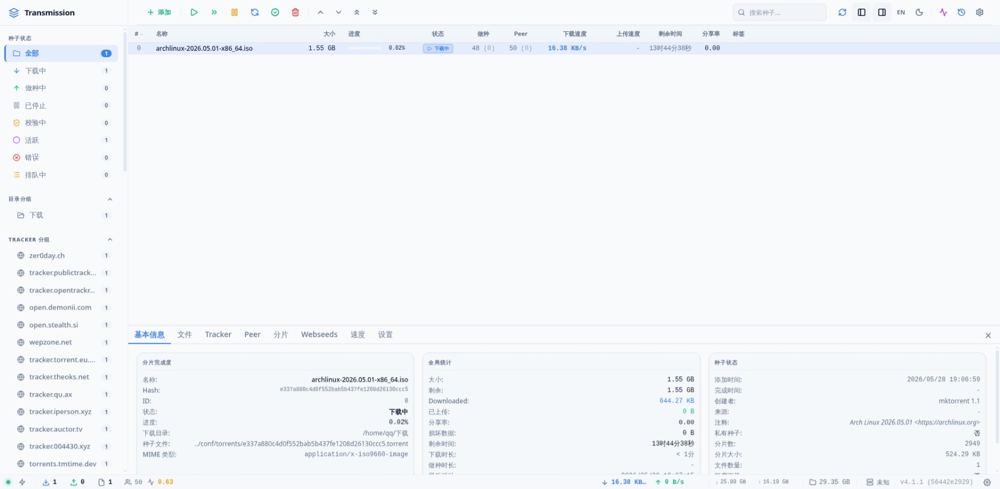
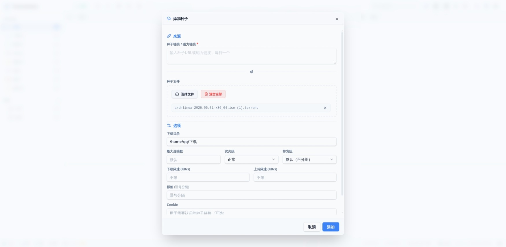
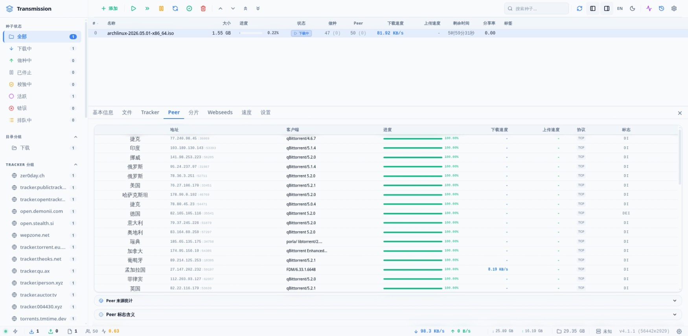
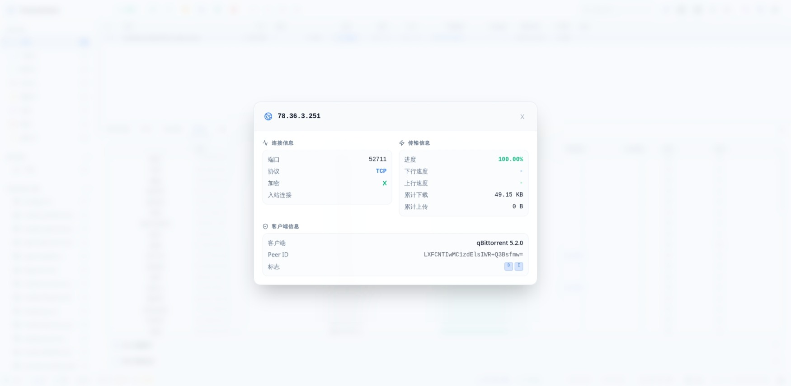
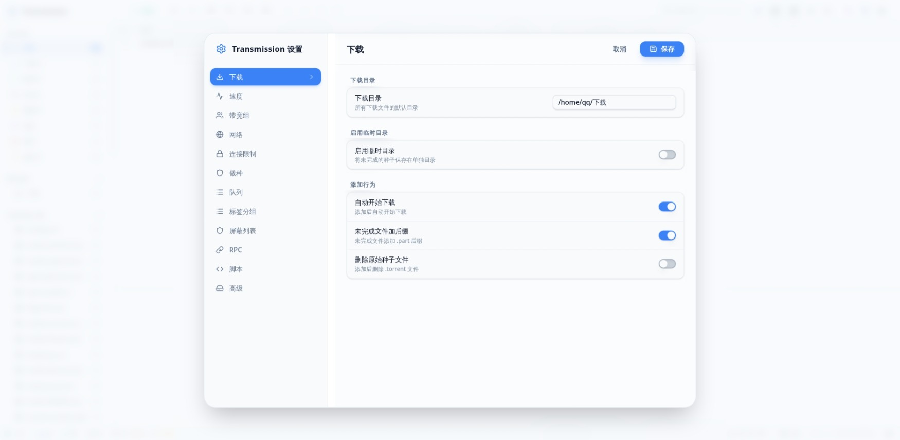
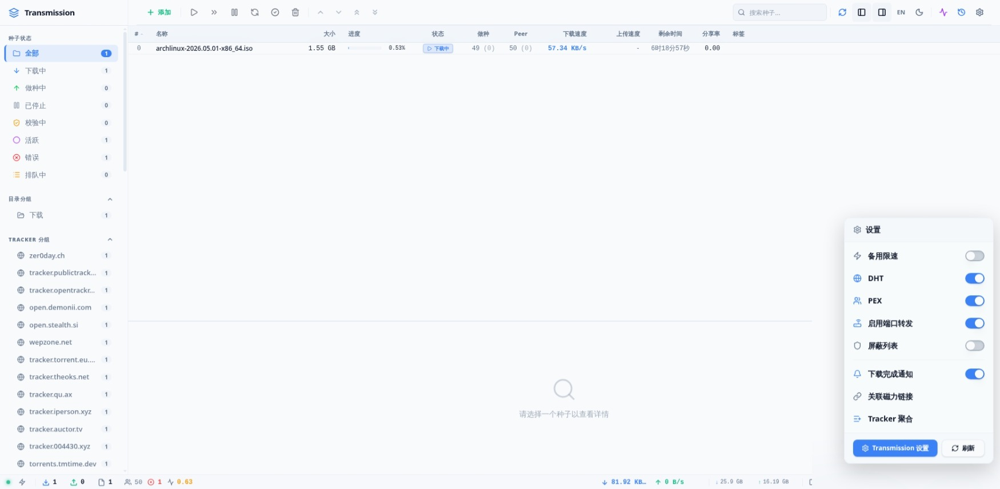
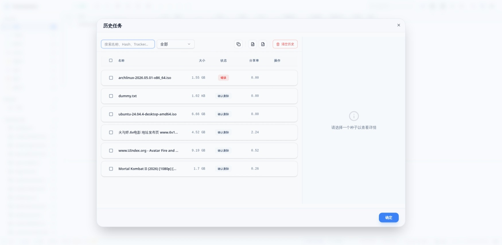

# Transmission Web Manager (TRWM)

[](https://github.com/user/trwm)
[](LICENSE)
[](https://www.solidjs.com/)
[](https://vite.dev/)
[](https://www.typescriptlang.org/)

基于 SolidJS 的现代化 Transmission BitTorrent 客户端 Web 管理界面，从传统 jQuery 架构完整重写而来。

> **核心原则**：零外部 CDN 依赖，单文件 `index.html` 部署，离线可用

---

## 界面预览

### 主页面



种子列表主界面，支持虚拟滚动、多列排序、右键菜单操作和拖拽调整列宽。

### 添加任务



支持磁力链接、URL 和本地 .torrent 文件添加，可配置下载目录、标签、限速等选项。

### 详情面板 - 用户





Peer 详情面板，显示连接用户的 IP 国旗（GeoIP）、协议类型（uTP/TCP）、Flags 和客户端标识。

### 全局设置



12 个配置页签，涵盖下载、速度、网络、做种、队列、黑名单等完整配置项。

### 快捷设置



一键切换备用限速、DHT、PEX、端口转发等常用功能。

### 历史档案馆



种子删除后自动归档，支持搜索、过滤、复制磁力链接和导出 JSON/CSV。

---

## 特性总览

| 特性 | 说明 |
|:---|:---|
| SolidJS 驱动 | Signal 实现编译期真实 DOM 细粒度直连刷新，面对高频 RPC 轮询仅精确修改对应 DOM 节点 |
| 双协议兼容 | 同时支持 Transmission 4.1+ JSON-RPC 2.0 和旧版 3.x/4.0.x RPC 协议，自动检测无缝切换 |
| 虚拟滚动 | 基于 @tanstack/solid-virtual，万级种子列表恒定 60FPS |
| 本地历史档案馆 | 基于 IndexedDB (Dexie) 的种子历史快照引擎，支持搜索、导出 JSON/CSV |
| GeoIP 国旗 | 客户端 MaxMind MMDB 解析，IP 地址实时转国旗图标（纯前端，零后端依赖） |
| 深色/浅色主题 | 基于 CSS 变量 + Tailwind CSS v4 的完整主题系统，支持系统偏好自动检测 |
| 中英文双语 | 完整的 i18n 国际化支持，一键切换语言 |
| 单文件部署 | vite-plugin-singlefile 将所有资源内联到单个 HTML，拷贝即部署 |

## 种子管理

| 功能 | 说明 |
|:---|:---|
| 添加种子 | 支持磁力链接、URL、本地 .torrent 文件（支持多文件拖拽和选择） |
| 种子操作 | 开始、暂停、校验、重新宣告、删除（可选删除数据） |
| 队列管理 | 上移、下移、置顶、置底 |
| 批量操作 | Ctrl/Shift 多选，右键菜单批量操作 |
| 限速设置 | 单种子下载/上传限速、带宽优先级 |
| 标签系统 | 自定义标签，侧边栏按标签过滤 |
| 顺序下载 | 支持从指定片段开始顺序下载 |
| 文件管理 | 文件下载意愿切换、优先级设置、行内重命名 |
| 目录移动 | 在线修改下载目录并移动文件 |
| 遵守会话限速 | 单个种子可独立控制是否遵守全局限速 |

## 详情面板（7 个标签页）

| 标签页 | 功能 |
|:---|:---|
| 常规 (General) | 40+ 项种子元数据 |
| 文件 (Files) | 文件树展示、下载意愿切换、优先级循环、行内重命名 |
| 服务器 (Trackers) | Tracker 列表、添加/删除/替换（使用 tracker_list 新参数）、Announce/Scrape 详情 |
| 用户 (Peers) | GeoIP 国旗、uTP/TCP 协议、Flags 字典、客户端标识 |
| 分块 (Pieces) | Canvas 矩阵可视化、点击设置顺序下载起点 |
| 速度 (Speed) | Canvas 实时下载/上传速度面积图 |
| 设置 (Settings) | 单种子限速、带宽组、分享率、做种时间、连接数、遵守会话限速开关 |

## 全局设置（12 个配置页签）

| 页签 | 配置项 |
|:---|:---|
| 下载 | 默认目录、临时目录、自动开始、删除原始文件 |
| 速度 | 全局限速、备用限速、计划任务限速（星期掩码） |
| 带宽组 | Transmission 4.0+ 带宽分组管理 |
| 网络 | 端口、UPnP、DHT/PEX/LPD/uTP/TCP、加密、防暴破、传输偏好 |
| 节点 | 全局/单任务最大连接数 |
| 做种 | 分享率限制、闲置时间限制 |
| 队列 | 下载/做种队列大小、停滞判断阈值 |
| 标签 | 本地标签库管理 |
| 黑名单 | IP 黑名单开关、URL、一键更新、端口测试 |
| RPC | 只读连接信息（版本、Session ID） |
| 脚本 | 生命周期钩子脚本路径 |
| 高级 | 磁盘缓存、默认 Tracker 列表、守护进程关闭 |

## 其他功能

- **历史档案馆** — 种子删除后自动归档，支持搜索、过滤、复制磁力链接、导出 JSON/CSV
- **统计面板** — 累计/当前会话流量统计、速度图表、种子状态分布
- **快捷设置** — 一键切换备用限速、DHT、PEX、端口转发等
- **键盘快捷键** — F5 刷新、Ctrl+N 添加、Delete 删除、Ctrl+A 全选
- **列配置** — 右键表头显隐列、拖拽调整列宽（支持触摸）、双击自适应、点击排序
- **拖拽添加** — 拖拽 .torrent 文件到浏览器窗口直接添加，支持多文件
- **单位自适应** — 根据 Transmission 服务器 `units` 配置自动切换 1000/1024 进制

## 技术栈

| 技术 | 版本 | 用途 |
|:---|:---|:---|
| [SolidJS](https://www.solidjs.com/) | ^1.9.12 | 响应式 UI 框架 |
| [Vite](https://vite.dev/) | ^8.0.12 | 构建工具 |
| [Tailwind CSS](https://tailwindcss.com/) | ^4.3.0 | 原子化 CSS 框架 |
| [Kobalte](https://kobalte.dev/) | ^0.13 | Headless UI 组件（Dialog, Select, Switch, ContextMenu, Tabs, Checkbox, Tooltip, Toast） |
| [Dexie.js](https://dexie.org/) | ^4.4.2 | IndexedDB 封装，历史快照持久化 |
| [@tanstack/solid-virtual](https://tanstack.com/virtual) | ^3.13.25 | 虚拟滚动引擎 |
| [@tanstack/solid-query](https://tanstack.com/query) | ^5.100.14 | 声明式数据获取 |
| [Lucide Solid](https://lucide.dev/) | ^1.16.0 | SVG 图标库 |
| [class-variance-authority](https://cva.style/) | ^0.7.1 | 组件变体样式 |
| [TypeScript](https://www.typescriptlang.org/) | ~6.0.2 | 类型安全 |
| [vite-plugin-singlefile](https://github.com/richardtallent/vite-plugin-singlefile) | ^2.3.3 | 单文件打包 |

## 项目结构

```
src/
├── api/                    # RPC 通信层
│   ├── queries.ts          # TanStack Query hooks
│   ├── rpc.ts              # JSON-RPC 2.0 客户端
│   ├── rpc-legacy.ts       # 旧版协议兼容层
│   └── rpc-session.ts      # 共享会话状态
├── components/
│   ├── DetailPanel/        # 详情面板（7 个 Tab + SettingsTab）
│   ├── Modals/             # 模态框（6 个 + 12 个配置页签）
│   ├── TorrentTable/       # 虚拟滚动种子表格
│   ├── ui/                 # 通用 UI 组件（9 个）
│   ├── AppLayout.tsx       # 主布局（可拖拽详情面板）
│   ├── ContextMenu.tsx     # 右键菜单
│   ├── LabelDialog.tsx     # 标签对话框
│   ├── QuickSettings.tsx   # 快捷设置面板
│   ├── Sidebar.tsx         # 侧边栏过滤导航
│   ├── StatusBar.tsx       # 底部状态栏
│   ├── Toolbar.tsx         # 顶部工具栏
│   └── ToastContainer.tsx  # 通知容器
├── hooks/
│   └── createResizableColumns.ts  # 可拖拽列宽 Hook
├── lib/
│   └── utils.ts            # cn() 类名合并工具
├── store/
│   ├── db.ts               # Dexie 数据库定义
│   ├── modalStore.ts       # 模态框状态
│   └── torrentStore.ts     # 种子数据核心 Store
├── styles/
│   └── theme.css           # 主题变量 + Tailwind 配置
├── types/
│   └── transmission.ts     # Transmission RPC 类型定义
├── utils/
│   ├── i18n/               # 国际化（en.ts, zh-CN.ts, index.ts）
│   ├── format.ts           # 格式化工具
│   ├── geoip.ts            # MaxMind MMDB 客户端解析器
│   ├── persist.ts          # localStorage 持久化 Signal
│   └── toast.tsx           # Toast 通知系统
├── App.tsx                 # 根组件
└── index.tsx               # 入口文件
```

## 快速开始

### 前置条件

- Node.js >= 18
- 本地运行 Transmission 守护进程（默认端口 9091）

### 安装与开发

```bash
git clone <repository-url>
cd trwm
npm install
npm run dev
```

开发服务器默认代理 `/transmission/rpc` 到 `http://localhost:9091`。可通过环境变量 `TR_RPC_URL` 指定其他地址。

### 构建生产版本

```bash
npm run build
```

构建产物为单个 `dist/index.html` 文件，包含所有 JS、CSS 和 SVG 资源。GeoIP MMDB 和国旗 SVG 文件需放置在同目录下。

### 其他命令

```bash
npm run lint          # ESLint 检查
npm run lint:fix      # ESLint 自动修复
npm run format        # Prettier 格式化
npm run format:check  # Prettier 检查
npm run preview       # 预览生产构建
```

## 配置说明

### RPC 认证

如果 Transmission 启用了 RPC 认证，可通过 Vite 环境变量配置：

```bash
# .env.local
VITE_RPC_AUTH=username:password
```

> 提供原始的 `username:password` 字符串即可，代码会自动进行 Base64 编码。

### 部署方式

1. **替换默认 WebUI**：将 `dist/index.html` + `dist/geo/` + `dist/flags/` 复制到 Transmission 的 Web 目录
2. **反向代理**：通过 Nginx 等反向代理同时提供 TRWM 和 Transmission RPC 服务

或设置环境变量：

```bash
TRANSMISSION_WEB_HOME=/path/to/trwm/dist transmission-daemon
```

## RPC 协议支持

| 维度 | JSON-RPC 2.0 (4.1+) | 旧式协议 (3.x/4.0.x) |
|:---|:---|:---|
| 请求格式 | `{"jsonrpc": "2.0", "method": "torrent_get", "params": {...}}` | `{"method": "torrent-get", "arguments": {...}}` |
| 方法名 | snake_case (`torrent_get`) | hyphenated (`torrent-get`) |
| 字段名 | snake_case (`hash_string`) | camelCase/kebab-case 混合 |
| 响应数据 | `result` 字段 | `arguments` 字段 |
| 认证 | Basic Auth 请求头 | Basic Auth 请求头 |
| CSRF | X-Transmission-Session-Id + 409 重试 | 同 |

协议自动检测：首次请求使用 JSON-RPC 2.0 格式，若响应不含 `jsonrpc` 字段则自动回退到旧版协议。

### 已实现的 RPC 方法（20+）

`torrent_get` · `torrent_set` · `torrent_add` · `torrent_remove` · `torrent_start` · `torrent_start_now` · `torrent_stop` · `torrent_verify` · `torrent_reannounce` · `torrent_set_location` · `torrent_rename_path` · `session_get` · `session_set` · `session_stats` · `session_close` · `group_get` · `group_set` · `port_test` · `blocklist_update` · `free_space` · `queue_move_up/down/top/bottom`

## 国际化

支持中文（zh-CN）和英文（en），通过工具栏语言按钮一键切换，语言偏好持久化到 localStorage。

翻译文件位于 `src/utils/i18n/`：

| 文件 | 说明 |
|:---|:---|
| `en.ts` | 英文翻译（~937 行） |
| `zh-CN.ts` | 中文翻译（~937 行） |
| `index.ts` | i18n 核心：`t()` 函数、点号路径键查找、参数插值、英文回退 |

添加新语言：

1. 复制 `en.ts` 为新语言文件（如 `ja.ts`）
2. 翻译所有键值
3. 在 `index.ts` 中注册新语言

## 主题系统

基于 CSS 自定义属性 + Tailwind CSS v4 的双层主题架构：

- **Tailwind 语义色**：`bg-primary`、`text-secondary`、`border-destructive` 等
- **CSS 变量**：`--color-primary-500`、`--color-background` 等
- **深色模式**：通过 `data-theme="dark"` 属性切换
- **系统偏好**：自动检测 `prefers-color-scheme` 媒体查询
- **平滑过渡**：主题切换时 CSS transition 动画

## 浏览器兼容性

| 浏览器 | 支持状态 |
|:---|:---|
| Chrome 90+ | 完全支持 |
| Edge 90+ | 完全支持 |
| Firefox 90+ | 基本支持（滚动条样式不生效） |
| Safari 15+ | 基本支持（需测试 backdrop-filter） |
| 移动端 | 不支持（无响应式适配） |

## 架构亮点

- **细粒度响应式**：SolidJS signals + createStore + reconcile 实现逐种子差异更新
- **协议抽象**：透明 RPC 层，自动检测协议版本、字段名映射、CSRF 重试
- **虚拟滚动**：@tanstack/solid-virtual 实现与种子数量无关的恒定时间渲染
- **客户端 GeoIP**：纯 TypeScript MMDB 解析器，零服务端依赖
- **历史引擎**：Dexie IndexedDB 自动快照同步，删除时归档
- **单文件输出**：vite-plugin-singlefile 实现零依赖部署

## License

[Apache License 2.0](LICENSE)
